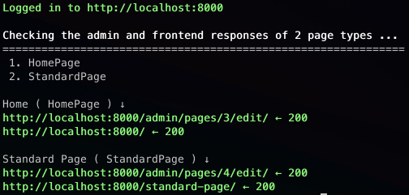

# Admin Responses

The `admin_responses` command will make a requests to the admin interface using get requests for a range of models. It will write a response result to the console.

Reports can be generated for:

- Admin Listing and Edit pages
- Frontend Pages

You can also add admin reports covering:

- Snippets
- Settings
- ModelAdmin
- Pages
- and more...

## Usage

Create a command class in your app's `management/commands` directory thats inherits from `BaseAdminResponsesCommand` with the following content:

```python
from wagtail_devtools.management.commands._base_admin_responses import (
    BaseAdminResponsesCommand,
)


class Command(BaseAdminResponsesCommand):
    def get_reports(self, *args, **options):
        session = self._log_in(options)

        register_reports = [
            # Add your reports here
        ]
```

You can use any name for the command file, but it must be in the `management/commands` directory.

I'll use `report_responses.py` as an example.

### Page Models Report

Will generate a report for all admin edit pages for all page type models and corresponding frontend pages.

It does this by automatically finding all page models, then using a get request it will check the response status code for the admin edit page and the frontend page.

#### Setup

Add the following item to the `register_reports` list:

```python
{
    "function": self.report_pages,
    "args": [session, options],
}
```

- `function` is the function that will be called to generate the report.
- `args` is a list of arguments that will need to be passed to the function.
  - `session` is the session object that will be used to make the requests.
  - `options` is the commands options object that is passed to the command.

#### Example Console Output



If your terminal allows it the links should be clickable.

Any pages that return a response code other than 200 will be highlighted in red.

### Admin Listing Pages Report

Will generate a report for all admin listing pages.

```python
{
    "function": self.report_admin_list_pages,
    "args": [
        session,
        "Dashboard",
        f"{options['host']}{reverse('wagtailadmin_home')}",
    ],
}
```

It does this by making a get request to the specified admin listing page and checking the response status code.

- `function` is the function that will be called to generate the report.
- `args` is a list of arguments that will need to be passed to the function.
  - `session` is the session object that will be used to make the requests.
  - `Dashboard` is the title of the report.
  - `f"{options['host']}{reverse('wagtailadmin_home')}"` is the url of the admin listing page to check.

#### Other admin listing page reports

You can also generate reports for other admin listing pages. Use the following wagtail urls as the third argument and a title of the report as the second argument:

- Aging Pages: `f"{options['host']}{reverse('wagtailadmin_reports:aging_pages')}"`
- Collections: `f"{options['host']}{reverse('wagtailadmin_collections:index')}"`
- Dashboard: `f"{options['host']}{reverse('wagtailadmin_home')}"`
- Documents: `f"{options['host']}{reverse('wagtaildocs:index')}"`
- Groups: `f"{options['host']}{reverse('wagtailusers_groups:index')}"`
- Images: `f"{options['host']}{reverse('wagtailimages:index')}"`
- Locked Pages: `f"{options['host']}{reverse('wagtailadmin_reports:locked_pages')}"`
- Redirects: `f"{options['host']}{reverse('wagtailredirects:index')}"`
- Search: `f"{options['host']}{reverse('wagtailadmin_explore_root')}"`
- Site History: `f"{options['host']}{reverse('wagtailadmin_reports:site_history')}"`
- Sites: `f"{options['host']}{reverse('wagtailsites:index')}"`
- Snippets: `f"{options['host']}{reverse('wagtailsnippets:index')}"`
- Users: `f"{options['host']}{reverse('wagtailusers_users:index')}"`
- Workflow List: `f"{options['host']}{reverse('wagtailadmin_workflows:index')}"`
- Workflow Tasks: `f"{options['host']}{reverse('wagtailadmin_workflows:task_index')}"`

### Admin Model Edit Pages Report

Will generate a report for the admin edit page using the specified app and model.

It does this by making a get request to the corresponding admin edit page for the model and checking the response status code.

```python
{
    "function": self.report_admin_app_model,
    "args": [
        session,
        options,
        "WORKFLOWS EDIT",
        "wagtailcore",
        "Workflow",
    ],
},
```

- `function` is the function that will be called to generate the report.
- `args` is a list of arguments that will need to be passed to the function.
  - `session` is the session object that will be used to make the requests.
  - `options` is the commands options object that is passed to the command.
  - `WORKFLOWS EDIT` is the title of the report.
  - `wagtailcore` is the app name.
  - `Workflow` is the model name.

#### Other admin app.model reports

You can also generate reports for edit pages for other models:

- Documents: `report_documents`
- Images: `report_images`
- Users: `report_users`
- Groups: `report_groups`
- Sites: `report_sites`
- Collections: `report_collections`
- Snippets: `report_snippets`


### ModelAdmin Reports

Will generate a report for the admin edit page using the specified modeladmin models.

It does this by making a get request to the corresponding admin edit page for the model and checking the response status code.

```python
{
    "function": self.report_model_admin,
    "args": [session, options, ["app.Model"]],
}
```

- `function` is the function that will be called to generate the report.
- `args` is a list of arguments that will need to be passed to the function.
  - `session` is the session object that will be used to make the requests.
  - `options` is the commands options object that is passed to the command.
  - `["app.Model"]` is a list of registered modeladmin app.model strings.
